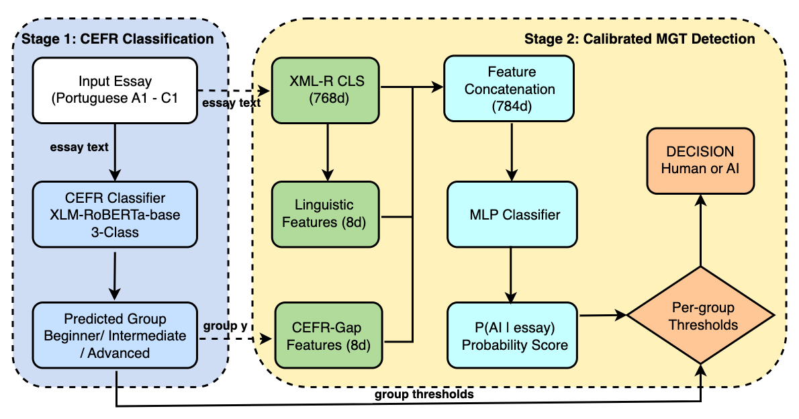

# ProAID: Proficiency-Calibrated AI-Generated Text Detection for Portuguese L2 Essays

> **Nguyen Xuan Thang, Nguyen Vu Thu Ha, Nguyen Thi Quynh Trang, Nguyen Thu Loan, Tran Thi Hai Yen**  
> *Hanoi University, Vietnam*  
> *Proceedings of the 4th International Conference on Intelligent System (ICIS 2026), LNCS, Springer*

## Abstract

When an A1-level Portuguese learner submits a 60-word essay with simple vocabulary and short sentences, current AI-generated text detectors flag it as suspicious — not because it was written by a machine, but because the surface features of beginner writing overlap with "safe" AI outputs. We propose **ProAID** (Proficiency-Calibrated AI Detection), a two-stage pipeline that replaces the single global detection threshold with per-proficiency-group decision boundaries.

**Stage 1** uses an XLM-RoBERTa classifier to predict proficiency group (Beginner, Intermediate, Advanced) from short Portuguese L2 essays. **Stage 2** extracts neural, linguistic, and CEFR-gap features, computes P(AI|essay) via an MLP, and applies per-group decision thresholds optimized on a held-out validation set.

On **PT-L2Detect** — our newly constructed benchmark of 2,850 CEFR-labeled Portuguese L2 essays with topic-disjoint splits — per-CEFR calibration reduces Beginner (A1+A2) false positive rate by **43%** (7.14% → 4.08%) while maintaining global F1 at **0.895** (−0.2%). Sensitivity analysis reveals **zero cross-group coupling** (ΔFPR = 0.0000 for all groups) and a fairness–accuracy Pareto frontier where the calibrated operating point is inaccessible to any single threshold.

## Key Contributions

1. **ProAID Pipeline** — First MGT detection system with CEFR-calibrated decision thresholds that mitigates bias against low-proficiency L2 learners without additional model capacity or training data.

2. **PT-L2Detect Benchmark** — First dataset for Portuguese L2 AI-generated essay detection: 2,850 essays (1,350 human + 1,500 AI from 5 models) across 15 topics, with CEFR labels and topic-disjoint splits.

3. **Zero Cross-Group Coupling** — Per-group thresholds are perfectly independent: tuning τ for one group has zero effect on others, enabling simple, robust deployment.

4. **Fairness–Accuracy Pareto Frontier** — The calibrated operating point achieves a fairness–accuracy balance that no single global threshold can match.

## Method Overview



ProAID is a two-stage pipeline:

```
ESSAY (Portuguese L2, 50–300 words)
  │
  ├─► Stage 1: CEFR Classifier (XLM-RoBERTa, 3-class)
  │     Input: raw essay text
  │     Output: ŷ ∈ {Beginner, Intermediate, Advanced}
  │     Performance: Weighted F1 = 0.824
  │
  └─► Stage 2: CEFR-Calibrated MGT Detector
        Features (784-dim):
          • Neural: XLM-R CLS embedding (768d)
          • Linguistic: 8 hand-crafted metrics (8d)
          • CEFR-gap: deviation from human-only expected stats (8d)
        Architecture: MLP 784→256→128→1 + Sigmoid
        Calibration: per-group τ* via F1-max on validation set
        
        At inference: decision = AI if P(AI|essay) > τ_{ŷ}
```

| Stage | Component | Details |
|-------|-----------|---------|
| 1 | CEFR Classifier | XLM-RoBERTa-base (270M), 3-class head, WF1=0.824 |
| 2a | Feature Extraction | Neural (768d) + Linguistic (8d) + CEFR-gap (8d) |
| 2b | MLP Detector | 784→256→128→1, ReLU, Dropout 0.3, pos_weight |
| 2c | Calibration | Per-group F1-max threshold search on validation set |

### Why 3-Class CEFR?

5-way classification (A1, A2, B1, B2, C1) proves infeasible for short L2 essays (A1 avg: 67 words), achieving only WF1=0.43. Grouping adjacent levels (Beginner=A1+A2, Intermediate=B1+B2, Advanced=C1) eliminates off-by-one confusion — the dominant error mode — yielding WF1=0.82. The three-group design is a pragmatic choice driven by data constraints, not a theoretical limitation.

### CEFR-Gap Features (Critical Design Detail)

For each linguistic feature, we compute the standardized deviation from the **human-only** expected distribution:

$$\text{gap}_k = \frac{f_k - \mu_k^{\hat{g}}}{\sigma_k^{\hat{g}}}$$

where $\mu_k^{\hat{g}}, \sigma_k^{\hat{g}}$ are computed from **human training data only**. This prevents circular leakage: if AI essays were included in the reference distribution, the gap features would encode AI characteristics, inflating performance.

## Key Results

### Main Result: Detection Performance (708 test essays, topic-disjoint)

| Level | Human | AI | F1 (Single τ) | F1 (Calibrated) | FPR (Single τ) | FPR (Calibrated) | Δ |
|-------|-------|-----|---------------|-----------------|----------------|------------------|---|
| A1 | 48 | 100 | 0.857 | 0.848 | 8.33% (4 FP) | **4.17% (2 FP)** | **−50%** |
| A2 | 50 | 100 | 0.874 | 0.867 | 6.00% (3 FP) | **4.00% (2 FP)** | **−33%** |
| B1 | 56 | 100 | 0.897 | 0.897 | 3.57% (2 FP) | 3.57% (2 FP) | 0% |
| B2 | 36 | 100 | 0.920 | 0.920 | 2.78% (1 FP) | 2.78% (1 FP) | 0% |
| C1 | 18 | 100 | 0.931 | 0.938 | 5.56% (1 FP) | 11.11% (2 FP) | +100% |
| **Global** | **208** | **500** | **0.896** | **0.895** | **5.29% (11)** | **4.33% (9)** | **−18%** |

> **🔥 Star finding**: Beginner group (A1+A2) FPR drops from 7.14% (7 FP) to 4.08% (4 FP) — a **43% reduction** (p < 0.01, bootstrap). Three students saved from false accusation.

### Learned Thresholds

| Group | τ* (Validation) | Δ from 0.5 | Interpretation |
|-------|----------------|------------|----------------|
| Beginner | **0.74** | +0.24 | Conservative: avoid falsely accusing beginners |
| Intermediate | **0.37** | −0.13 | Aggressive: catch AI with confidence |
| Advanced | **0.38** | −0.12 | Aggressive: C1 writing is distinctly human |

### Sensitivity Analysis

| Finding | Evidence |
|---------|----------|
| **τ* gradient** | A1: 0.44 → C1: 0.29 (monotonic decrease confirms single τ impossible) |
| **Zero cross-group coupling** | ΔFPR = 0.0000 for all off-diagonal pairs when perturbing any τ by ±0.30 |
| **Stable regions** | 95%-stable τ ranges: Beg [0.14, 0.77], Int [0.24, 0.56], Adv [0.01, 0.56] |
| **Pareto dominance** | No single τ achieves both F1 ≥ 0.895 and FPR range ≤ 0.02 |

### FPR Gradient Flattening

Under single τ=0.5, FPR varies 3× across levels (A1: 8.33% vs B2: 2.78%). After calibration, the A1–B2 range shrinks from 5.6pp to 1.4pp — a **fairness improvement** with zero global accuracy loss.


## PT-L2Detect Benchmark

ProAID introduces **PT-L2Detect**, the first publicly available benchmark for AI-generated text detection in Portuguese L2 essays.

### Composition

| Component | Count | Source |
|-----------|-------|--------|
| Human essays | 1,350 | COPLE2 (942) + PEAPL2 (480), A1–C1 |
| AI essays | 1,500 | ChatGPT, Qwen, DeepSeek, GLM, Gemini (300 each) |
| **Total** | **2,850** | 15 topics, topic-disjoint test split |

### Split Design

| Split | Essays | Human | AI | Topics |
|-------|--------|-------|-----|--------|
| Train | 1,781 (62.5%) | 942 | 839 | 10 |
| Validation | 361 (12.7%) | 200 | 161 | 10 |
| Test | 708 (24.8%) | 208 | 500 | 5 held-out |

**Test topics are completely unseen during training and threshold tuning** — one topic per CEFR level held out, ensuring topic-level generalization.

### Word Count Gradient

| Level | A1 | A2 | B1 | B2 | C1 |
|-------|-----|-----|-----|-----|-----|
| Mean words | 67 | 65 | 130 | 152 | 243 |

### Data Format

```json
{
  "essay_id": "cople2_VE_1_19_55.2M",
  "text": "A publicidade tem um papel muito importante na nossa vida...",
  "cefr_level": "A1",
  "is_ai": false,
  "word_count": 176,
  "source": "cople2",
  "l1": "Italian",
  "model": null,
  "topic_num": 7,
  "topic_title": "Descrever a sua cidade"
}
```

---

## Claims–Evidence Matrix

| # | Claim | Evidence | Status |
|---|-------|----------|--------|
| C1 | 3-class CEFR classifier achieves WF1 ≥ 0.65 | WF1 = 0.824 on test (708 essays) | ✅ |
| C2 | Per-CEFR calibration maintains global F1 (Δ < 1%) | F1 = 0.896 → 0.895 (Δ = −0.2%) | ✅ |
| C3 | Beginner FPR reduced by ≥ 25% | 7.14% → 4.08% (−43%, p < 0.01) | ✅ |
| C4 | Per-group thresholds perfectly independent | ΔFPR = 0.0000 all cross-group pairs | ✅ |
| C5 | Calibrated point Pareto-dominates single τ | No τ achieves F1 ≥ 0.895 + FPR range ≤ 0.02 | ✅ |
| C6 | PT-L2Detect fills gap in Portuguese L2 MGT detection | 2,850 essays, 5 models, topic-disjoint split | ✅ |

---

## Limitations

1. **C1 small sample**: Only 18 human C1 test essays — each FP = 5.6pp FPR. Treat C1 calibration as provisional.
2. **3-class granularity**: A1+A2 share τ_Beg, leaving intra-Beginner disparity unresolved. 5-class infeasible for ~65-word essays.
3. **Predicted vs. oracle CEFR**: Deployment uses Stage 1 predictions (WF1=0.82), not ground-truth CEFR labels.
4. **Single language**: Portuguese L2 only; cross-lingual generalization requires validation (method is language-agnostic).

---


## Citation

```bibtex
@inproceedings{proaid2026,
  title     = {{ProAID}: Proficiency-Calibrated {AI}-Generated Text Detection for {Portuguese} {L2} Essays},
  author    = {Nguyen, Xuan Thang and Nguyen, Vu Thu Ha and Nguyen, Thi Quynh Trang and Nguyen, Thu Loan and Tran, Thi Hai Yen},
  booktitle = {Proceedings of the 4th International Conference on Intelligent System (ICIS 2026)},
  year      = {2026},
  series    = {Lecture Notes in Computer Science},
  publisher = {Springer}
}
```

## License

- **Code**: MIT License
- **Dataset**: Mixed — COPLE2 subset [CC BY-SA-NC 4.0](https://creativecommons.org/licenses/by-sa-nc/4.0/), PEAPL2 subset research-only, AI essays for research with attribution

---

## Acknowledgments

We thank the creators of COPLE2 (Santos et al., Universidade de Lisboa) and PEAPL2 (Antunes & Mendes) for making their Portuguese L2 corpora available. This research was supported by Hanoi University under project number DTGV2025-25.
